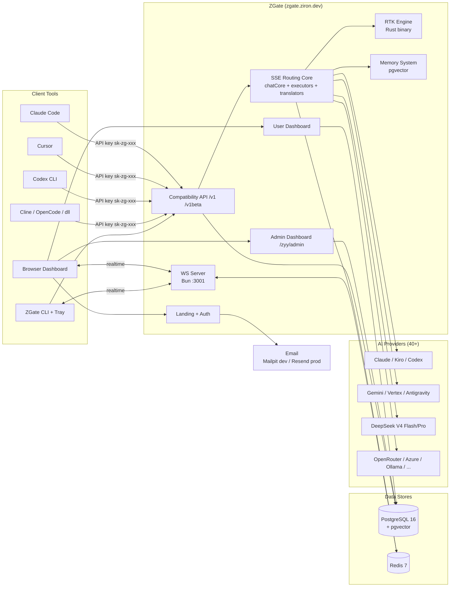
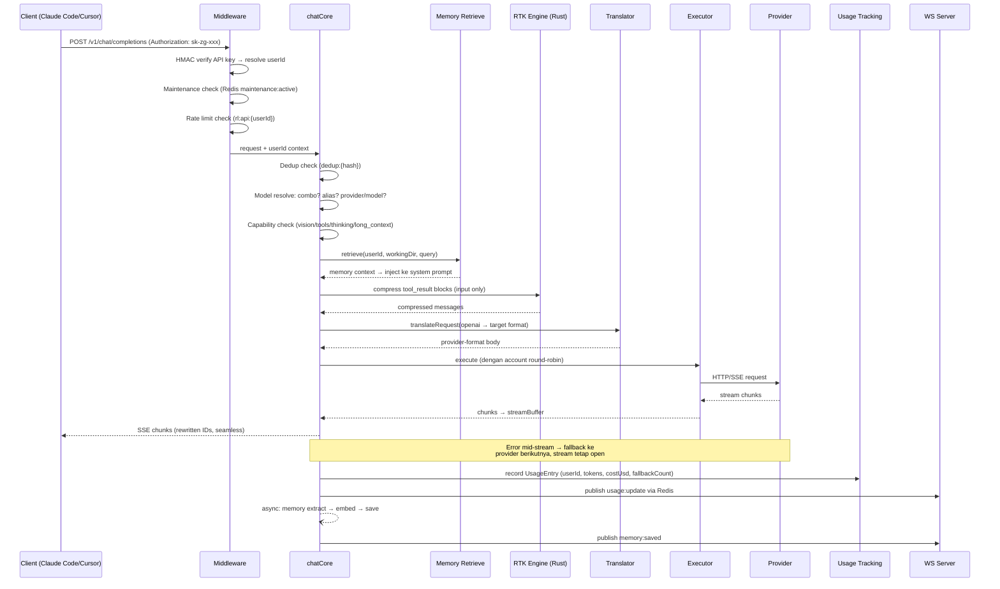
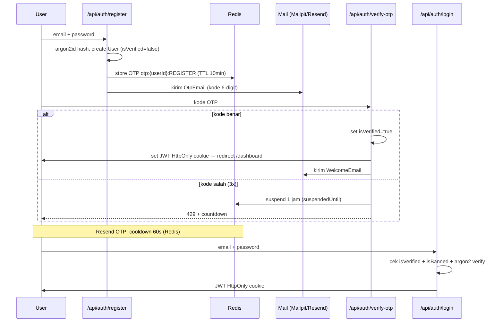
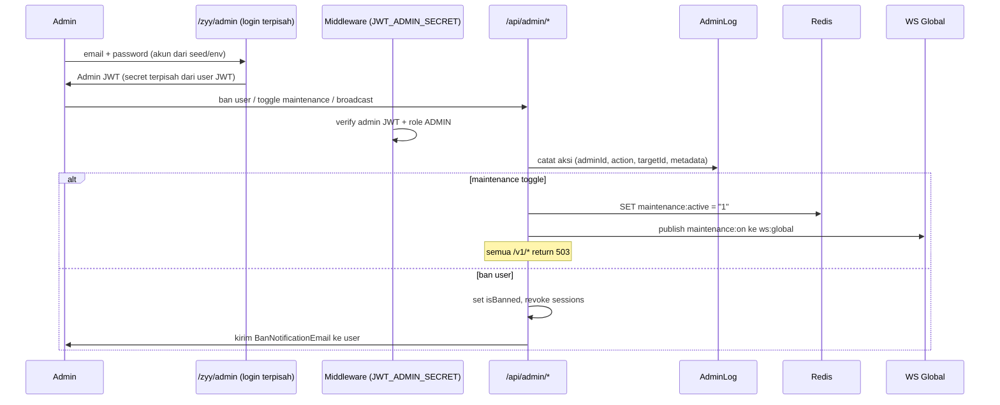
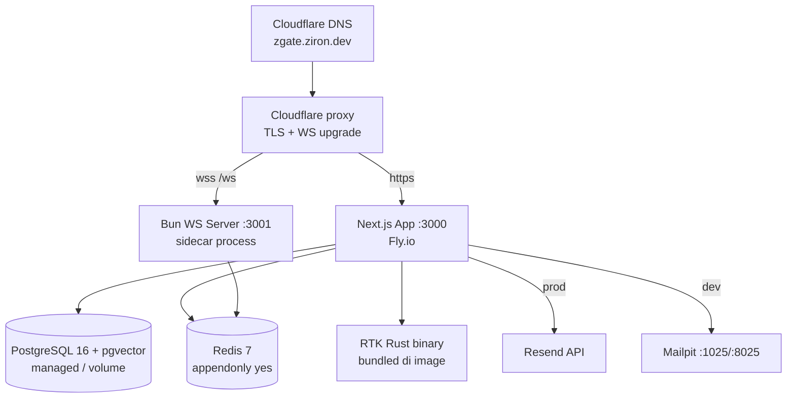

# ZGate — Architecture

> Universal AI Gateway & Router — hosted multi-user SaaS di `zgate.ziron.dev`.
> Full reimplementasi 9Router dengan stack modern, TypeScript-first, multi-user.

---

## 1. Executive Summary

ZGate adalah hosted multi-user SaaS AI gateway. Setiap user mendaftar dengan email
(OTP verification), menghubungkan provider connections miliknya sendiri (**BYOK —
Bring Your Own Key**, ZGate tidak menyediakan built-in provider/credits), membuat
ZGate API key (`sk-zg-...`), lalu memakai satu endpoint
(`https://zgate.ziron.dev/v1`) dari tool apapun (Claude Code, Cursor, Codex, Cline,
dll). ZGate menerjemahkan format request/response antar provider (OpenAI ↔ Claude ↔
Gemini ↔ Kiro ↔ Cursor ↔ dll), melakukan combo fallback yang **full seamless**
(client tidak pernah tahu ada fallback), menghemat token via RTK (Rust engine),
menyimpan memory lintas sesi (pgvector), dan melaporkan usage real-time via
WebSocket.

Tidak ada plan/tier saat launch — semua user sama (Addendum 6). Cost budget tetap
ada sebagai kontrol personal per user.

---

## 2. System Context Diagram



---

## 3. Multi-User Model & Isolation

Setiap user memiliki data yang **terisolasi penuh**:

- **ProviderConnection** — kredensial provider milik user (OAuth tokens / API keys,
  encrypted at rest AES-256-GCM)
- **Combo** — urutan fallback model milik user
- **ApiKey** — ZGate API keys milik user (`sk-zg-` prefix, HMAC hashed)
- **ModelAlias / CustomModel / DisabledModel** — konfigurasi model per user
- **UsageEntry** — usage tracking per user
- **UserMemory / ConversationSession** — memory AI per user (TIDAK bisa diakses
  admin; encrypted per user key)

### Aturan isolasi (WAJIB — AGENTS.md §5)

1. SETIAP query Prisma yang menyentuh data user WAJIB include filter `userId`.
2. Middleware meng-inject `userId` dari JWT (dashboard) atau dari API key resolve
   (`/v1/*`) ke setiap request handler.
3. `userId` SELALU diambil dari auth context — TIDAK PERNAH dari request body.
4. Admin hanya bisa melihat provider connections user secara read-only (tanpa
   secrets) dan TIDAK bisa membaca memory user.

---

## 4. Core Components

| Komponen | Lokasi | Tanggung jawab |
|---|---|---|
| Landing + Auth layer | `app/(landing)`, `app/(auth)`, `src/app/api/auth/*` | Register (email OTP 6-digit), login, logout, JWT session |
| User Dashboard | `app/dashboard/*` | Providers, combos, keys, usage, settings, memory, webhooks, quota, CLI tools, basic chat |
| Admin Dashboard | `app/zyy/admin/*` | User management, global usage, maintenance, broadcast, audit log |
| API Compatibility layer | `src/app/api/v1/*`, `src/app/api/v1beta/*` | OpenAI & Anthropic-compatible endpoints |
| SSE/Routing Core | `open-sse/*` | chatCore, executors, translators, fallback engine, capability routing |
| RTK Engine | `rtk/` (Rust binary) + `src/lib/rtk.ts` | Kompresi `tool_result` di INPUT messages |
| Memory System | `src/lib/memory/*` | Extract → embed → retrieve → inject, pgvector semantic search |
| WS Server | `ws-server/` (Bun :3001) | Real-time push via Redis Pub/Sub |
| PostgreSQL | via Prisma `src/lib/db.ts` | Primary store (users, connections, combos, keys, usage, memory) |
| Redis | `src/lib/redis.ts` | Sessions, rate limit, OTP store, dedup, health cache, maintenance flag, Pub/Sub |
| Email | `src/lib/mail.ts`, `emails/*` | Mailpit (dev) / Resend (prod), React Email templates |

---

## 5. Request Lifecycle (`/v1/chat/completions`)



---

## 6. Auth Flow



OTP rules: 6 digit numerik, expiry 10 menit, resend cooldown 60 detik, 3x salah =
suspend 1 jam. OTP disimpan di Redis (`otp:{userId}:{type}`), bukan DB.

---

## 7. Admin Flow



---

## 8. Data Model (ER)

```mermaid
erDiagram
    User ||--o{ Session : has
    User ||--o{ OtpCode : has
    User ||--o{ ApiKey : owns
    User ||--o{ ProviderConnection : owns
    User ||--o{ ProviderNode : owns
    User ||--o{ ModelAlias : owns
    User ||--o{ Combo : owns
    User ||--o{ UsageEntry : generates
    User ||--o{ UserMemory : has
    User ||--o{ ConversationSession : has
    User ||--o{ CustomModel : owns
    User ||--o{ DisabledModel : owns
    User ||--o{ Webhook : owns
    User ||--o{ UserAuditLog : generates
    User ||--o{ ProxyPool : owns
    ProviderConnection ||--o{ CustomModel : scopes
    ProviderConnection ||--o{ ModelTestResult : tested
    ConversationSession ||--o{ UserMemory : produces
    AdminLog }o--|| User : "admin actor"

    User {
        string id PK
        string email UK
        string passwordHash
        boolean isVerified
        boolean isBanned
        datetime bannedAt
        string bannedReason
        enum role "USER|ADMIN"
        datetime createdAt
    }
    OtpCode {
        string id PK
        string userId FK
        string code
        enum type "REGISTER|RESET"
        datetime expiresAt
        int attempts
        datetime suspendedUntil
    }
    Session {
        string id PK
        string userId FK
        string token
        datetime expiresAt
    }
    ApiKey {
        string id PK
        string userId FK
        string name
        string keyHash
        string keyPrefix "sk-zg-xxxx"
        datetime lastUsedAt
        boolean isActive
    }
    ProviderConnection {
        string id PK
        string userId FK
        string provider
        string authType "oauth|apikey|cookie"
        string name
        int priority
        boolean isActive
        string accessToken "encrypted"
        string refreshToken "encrypted"
        string apiKey "encrypted"
        string baseUrl
        json metadata
    }
    ProviderNode {
        string id PK
        string userId FK
        string name
        string baseUrl
        string format "openai|anthropic"
        string apiKey "encrypted"
    }
    ModelAlias {
        string id PK
        string userId FK
        string alias
        string target "provider/model"
    }
    Combo {
        string id PK
        string userId FK
        string name
        json models "ordered array"
        string strategy "fallback|round-robin"
    }
    UsageEntry {
        string id PK
        string userId FK
        string provider
        string model
        int promptTokens
        int completionTokens
        float costUsd
        string connectionId
        int fallbackCount
        json fallbackProviders
        datetime timestamp
    }
    UserMemory {
        string id PK
        string userId FK
        enum scope "GLOBAL|PROJECT|SESSION"
        string workingDir
        string sessionId
        string content
        vector embedding "vector(1536)"
        float confidence
        int useCount
    }
    ConversationSession {
        string id PK
        string userId FK
        string workingDir
        string summary
        int messageCount
        int tokenCount
        string provider
        string model
        datetime endedAt
    }
    CustomModel {
        string id PK
        string userId FK
        string providerConnectionId FK
        string modelId
        string displayName
        string kind "llm|image|tts|embedding|stt"
    }
    DisabledModel {
        string id PK
        string userId FK
        string providerAlias
        string modelId
    }
    ModelTestResult {
        string id PK
        string userId
        string providerConnectionId FK
        string modelId
        string status "success|failed|slow"
        int responseMs
        string error
        datetime testedAt
    }
    Webhook {
        string id PK
        string userId FK
        string url
        string secret "HMAC signing key"
        json events
        boolean isActive
    }
    UserAuditLog {
        string id PK
        string userId FK
        string action
        json metadata
        string ip
        string userAgent
        datetime createdAt
    }
    ProxyPool {
        string id PK
        string userId FK
        string name
        string proxyUrl
        string noProxy
        string type "http|vercel|cloudflare|deno"
        boolean isActive
        boolean strictProxy
    }
    AdminLog {
        string id PK
        string adminId FK
        string action
        string targetId
        string targetType
        json metadata
        datetime createdAt
    }
    Pricing {
        string id PK
        string provider
        string model
        float inputPricePer1M
        float outputPricePer1M
    }
    Settings {
        string id PK
        string userId FK
        boolean rtkEnabled
        boolean memoryEnabled
        float maxCostPerRequest
        float maxCostPerDay
        float maxCostPerMonth
        json preferences
    }
```



---

## 9. Memory System Architecture

```
Incoming Request
     │
     ▼
Memory Retrieval (sebelum kirim ke provider)
     │
     ├── 1. Global memories user (always inject)
     ├── 2. Project memories WHERE workingDir match (via pgvector semantic search)
     └── 3. Session summary dari session sebelumnya di folder yang sama
     │
     ▼
Inject ke system prompt → kirim ke provider → stream response ke client
     │
     ▼ (async, setelah response selesai)
Memory Extraction
     ├── Panggil AI untuk ekstrak "memory facts" dari conversation
     ├── Generate embeddings untuk setiap fact (via /v1/embeddings)
     ├── Simpan ke UserMemory table (PostgreSQL + pgvector)
     └── Push status ke client via WebSocket "N memories saved"
```

### Memory Schema (Prisma)

```prisma
model UserMemory {
  id          String   @id @default(cuid())
  userId      String
  user        User     @relation(fields: [userId], references: [id], onDelete: Cascade)

  // Layer
  scope       MemoryScope  // GLOBAL | PROJECT | SESSION

  // Context
  workingDir  String?  // absolute path, null jika GLOBAL
  sessionId   String?  // null jika GLOBAL atau PROJECT

  // Content
  content     String   // teks memory fact
  embedding   Unsupported("vector(1536)")?  // pgvector

  // Metadata
  source      String?  // dari provider mana memory ini diekstrak
  confidence  Float    @default(1.0)
  createdAt   DateTime @default(now())
  updatedAt   DateTime @updatedAt
  lastUsedAt  DateTime?
  useCount    Int      @default(0)

  @@index([userId, scope])
  @@index([userId, workingDir])
  @@index([userId, sessionId])
}

enum MemoryScope {
  GLOBAL
  PROJECT
  SESSION
}

model ConversationSession {
  id          String   @id @default(cuid())
  userId      String
  user        User     @relation(fields: [userId], references: [id], onDelete: Cascade)

  workingDir  String?  // folder AI dijalankan
  summary     String?  // ringkasan session, dibuat setelah session selesai
  messageCount Int     @default(0)
  tokenCount   Int     @default(0)
  provider    String?
  model       String?

  createdAt   DateTime @default(now())
  updatedAt   DateTime @updatedAt
  endedAt     DateTime?

  memories    UserMemory[]  // via sessionId
}
```

### Memory rules

- 3 scope: **GLOBAL** (selalu inject), **PROJECT** (per workingDir, semantic search),
  **SESSION** (summary session terakhir di folder yang sama).
- Custom headers: `X-ZGate-Working-Dir`, `X-ZGate-Session-Id`, `X-ZGate-Memory: off`,
  `X-ZGate-Memory-Scope`.
- pgvector cosine similarity: operator `embedding <=> query_embedding`.
- Top-K retrieval: 5 global + 5 project + 1 session summary (max ~11 injections).
- Extraction berjalan ASYNC — tidak block response ke client.
- Privacy: memory TIDAK bisa diakses admin (encrypted per user key,
  `MEMORY_ENCRYPT_KEY`). Working dir di-hash jika user tidak mau path terlihat.
- Session summary digenerate setelah idle > 30 menit atau user close.

---

## 10. WebSocket Architecture

Bun native WebSocket server sebagai **sidecar process** (port 3001), Redis Pub/Sub
sebagai message broker (Addendum 2).

```
Next.js App (port 3000)          Bun WS Server (port 3001)
      │                                  │
      │  publish via Redis               │  subscribe Redis
      ▼                                  ▼
  Redis Pub/Sub  ←──────────────────────→
  channel: ws:user:{userId}       — notifikasi per user
  channel: ws:admin               — broadcast ke semua admin
  channel: ws:global              — broadcast maintenance mode dll
                                         │
                                         ▼
                                  Client Browser/CLI
                                  ws://zgate.ziron.dev/ws  (proxy → :3001)
```

### Events yang di-push ke client

```typescript
export type WSEvent =
  | { type: "memory:saved"; count: number; scope: MemoryScope }
  | { type: "session:ended"; sessionId: string; memoriesExtracted: number }
  | { type: "provider:status"; providerId: string; status: string; error?: string }
  | { type: "provider:health"; providerId: string; status: string; responseMs: number }
  | { type: "maintenance:on"; message?: string }
  | { type: "maintenance:off" }
  | { type: "usage:update"; tokens: number; costUsd: number; provider: string }
  | { type: "admin:broadcast"; message: string }
  | { type: "budget:warning"; percent: number }
  // Internal dashboard event — hanya untuk usage stats ZGate, BUKAN ke AI client tool
  | { type: "stream:fallback"; requestId: string; fromProvider: string; toProvider: string; atChunk: number }
```

### Rules

- Auth: verify JWT atau API key dari query param `?token=`.
- Satu Redis subscriber per WS server instance (bukan per client).
- Reconnect client: 1s → 2s → 4s → 8s → 16s → max 30s.
- Heartbeat: server ping setiap 30s, client harus pong dalam 10s atau disconnect.
- Prod: Nginx/Cloudflare proxy `/ws` → `ws-server:3001`.
- TIDAK ADA event `stream:recovering`/`[RECOVERING]` ke client — fallback full
  seamless (Addendum 3). Event `stream:fallback` hanya untuk dashboard ZGate.

---

## 11. Combo Fallback Flow (Full Seamless)

Prinsip: **client tidak pernah tahu ada fallback selama masih ada provider tersedia.**

```
ZGate menerima request
    │
    ▼
Buka stream ke client (SSE headers dikirim)
    │
    ▼
Provider 1 streaming...
    ├── chunk [id=0] → buffer + forward ke client ✓
    ├── chunk [id=1] → buffer + forward ke client ✓
    ├── chunk [id=2] → buffer + forward ke client ✓
    └── ERROR (mid-stream / timeout / 500)
            │
            │  ← client tidak tahu, stream tetap open
            ▼
    Build recovery request (recoveryPromptBuilder):
    - messages original
    - + {"role":"assistant","content":"<partial dari buffer>"}
    - + contextual recovery instruction (Layer 4)
    - kirim ke Provider 2 (stream tetap open ke client)
            │
            ▼
    Provider 2 streaming...
    ├── chunk [id=0] → rewrite id=3 → buffer + forward ke client ✓
    ├── chunk [id=1] → rewrite id=4 → buffer + forward ke client ✓
    └── [DONE] → forward ke client ✓

Client experience: satu stream continuous dari id=0 sampai selesai.
```

### Full Fallback Coverage

| Kasus | Handler | Behavior |
|---|---|---|
| Error sebelum stream mulai (4xx/5xx) | chatCore retry loop | Transparan |
| Error mid-stream < 20 chars | midStreamFallback | Restart ke provider berikutnya |
| Error mid-stream >= 20 chars | midStreamFallback + recovery | Lanjut seamless |
| Non-streaming error | nonStreamingHandler | Buffer + retry |
| Account 429 rate limit | accountFallback | Skip account, exponential backoff |
| Semua account satu provider habis | combo loop | Next model di combo |
| OAuth token expired | tokenRefresh + retry | Refresh → retry, transparan |
| TCP/Network disconnect | streamErrorDetector | Fallback, seamless |
| Malformed JSON chunk (1-2x) | streamErrorDetector | Skip chunk, lanjut |
| Malformed JSON chunk (3x berturut) | streamErrorDetector | Fallback |
| `finish_reason: error/content_filter` | streamErrorDetector | Fallback |
| Chunk timeout (30s tanpa chunk) | streamErrorDetector | Fallback |
| Empty stream (10s no first chunk) | streamErrorDetector | Fallback transparan |
| Semua combo model gagal | combo loop | Return error ke client |

Detail lengkap: `docs/COMBO.md` dan TASK-007.

---

## 12. Model Resolution Pipeline

Saat `/v1/models` dipanggil, ZGate build model list lewat pipeline ini:

1. Ambil semua active ProviderConnections user dari DB
2. Untuk tiap provider:
   a. Check apakah ada live resolver (Kiro, Qoder, Ollama, compatible)
      → kalau ada: fetch live, cache 5 menit
   b. Kalau tidak ada live resolver: pakai static PROVIDER_MODELS list
   c. Merge dengan CustomModels user untuk provider ini
   d. Filter out DisabledModels user
   e. Filter by kind (llm/image/tts/embedding/dll)
3. Merge semua model dari semua providers
4. Tambahkan Combo names di atas (selalu di posisi pertama)
5. Dedup, return sebagai OpenAI-format list

Cache strategy:
- Live model catalog: Redis key `models:live:{userId}:{providerId}` TTL 5 menit
- Invalidate saat: provider connection diupdate, model test dilakukan

Live resolvers (Addendum 7):
- **Kiro** — AWS CodeWhisperer `ListAvailableModels`, expand 4 variants
  (base, `-thinking`, `-agentic`, `-thinking-agentic`), cache 5 menit per credential
- **Qoder** — fetch dynamic per account
- **Ollama** — `GET {baseUrl}/api/tags`
- **Compatible** — `GET {baseUrl}/models` (Bearer/x-api-key), timeout 5s

Saat request masuk, field `model` di-resolve dengan urutan:
1. Nama Combo milik user → combo fallback chain
2. ModelAlias milik user → target `provider/model`
3. Format eksplisit `provider/model` → langsung ke connection provider tsb
4. Tidak ketemu → 404 `model_not_found`

---

## 13. Deployment Topology



- Single Docker image multi-stage: Rust RTK build → Next.js build → Bun runtime.
- WS server sebagai sidecar Bun process (port 3001); Nginx/Cloudflare proxy
  `/ws` → `ws-server:3001`.
- PostgreSQL image: `pgvector/pgvector:pg16` (extension `vector` via
  `scripts/init-db.sql`).
- Redis dengan `--appendonly yes`.
- Update via deployment pipeline (Fly.io utama; Railway alternatif) — TIDAK ADA in-app auto-updater
  (Addendum 9).

---

## 14. Module Mapping

```
app/
  (landing)/                      ← landing page public
  (auth)/login|register|verify/   ← auth pages
  dashboard/                      ← user dashboard (auth required)
    providers/ [id]/              ← provider connections + model management
    combos/                       ← combo builder
    models/                       ← model aliases
    keys/                         ← ZGate API keys
    usage/                        ← usage stats
    quota/                        ← provider quota tracking
    settings/                     ← RTK, profile, budget, danger zone
    memory/                       ← memory browser (via /api/memory)
    webhooks/                     ← webhook management
    audit-log/                    ← user audit log
    basic-chat/                   ← built-in chat tester
    cli-tools/ [toolId]/          ← CLI tools auto-config
    media-providers/tts|image|web ← TTS/image/web-search provider management
    translator/                   ← translator debugger (dev tool)
    console-log/                  ← live console log viewer (admin only)
    proxy-pools/                  ← proxy pool management
  zyy/admin/                      ← admin dashboard (login terpisah)
    dashboard/ users/ [id]/ usage/ maintenance/ broadcast/ audit-log/

src/
  middleware.ts                   ← JWT / admin JWT / API key guard
  lib/
    env.ts db.ts redis.ts         ← infra singletons (Zod validated env)
    auth.ts otp.ts password.ts apiKey.ts
    auth/oidc.ts                  ← OIDC (roadmap v2)
    rateLimit.ts                  ← sliding window Redis
    costBudget.ts                 ← per-request/day/month budget
    dedup.ts                      ← request deduplication
    providerHealth.ts             ← background health pinger
    adminLog.ts                   ← admin audit helper
    mail.ts                       ← Resend/Mailpit sender
    rtk.ts                        ← RTK subprocess wrapper (Bun.spawn)
    cloudSync.ts                  ← multi-device sync
    requestDetailsDb.ts           ← request detail storage
    memory/ extract.ts embed.ts retrieve.ts inject.ts session.ts
    ws/ publish.ts events.ts
    webhook/ deliver.ts sign.ts
  app/api/
    auth/*                        ← register, verify-otp, resend-otp, login, logout, me, oidc/*
    providers/* provider-nodes/*  ← CRUD + test + validate + test-batch + suggested-models
    oauth/[provider]/[action]/*   ← OAuth + device-code + special imports
    keys/* combos/* models/*      ← user management APIs
    pricing/ usage/* settings/ profile/ sync/cloud/
    memory/* sessions/*           ← memory APIs
    webhooks/* audit-log/ tags/   ← webhooks, user audit, Ollama tags
    proxy-pools/*                 ← proxy pools CRUD + deploy
    cli-tools/*                   ← per-tool config generators
    translator/*                  ← translator debug endpoints
    media-providers/tts/*         ← TTS voices
    health/ health/providers/
    locale/
    admin/*                       ← admin APIs
    v1/*  v1beta/*                ← compatibility APIs
  sse/handlers/chat.ts            ← /v1 entry point
  hooks/                          ← useWebSocket, useRealtimeUsage, dll
  shared/constants/locales.ts

open-sse/
  handlers/ chatCore.ts chatCore/{streamingHandler,nonStreamingHandler,
           sseToJsonHandler,requestDetail,midStreamFallback}.ts
           ttsCore.ts sttCore.ts ttsProviders/ imageProviders/ search/ fetch/
  executors/ base.ts default.ts deepseek.ts kiro.ts codex.ts ... index.ts
  translator/ formats.ts index.ts request/ response/ helpers/
  transformer/ responsesTransformer.ts streamToJsonConverter.ts
  services/ accountFallback.ts provider.ts model.ts tokenRefresh.ts
           capabilityRouter.ts liveModelResolvers.ts
  utils/ stream.ts streamHandler.ts usageTracking.ts clientDetector.ts
        streamBuffer.ts fallbackRecovery.ts streamErrorDetector.ts
        recoveryPromptBuilder.ts recoveryContextAnalyzer.ts modelKind.ts
  config/ modelCapabilities.ts ttsModels.ts googleTtsLanguages.ts

rtk/                              ← Rust crate (RTK engine)
  src/ lib.rs main.rs autodetect.rs compress.rs filters/

ws-server/                        ← Bun native WS sidecar
  index.ts auth.ts subscriber.ts package.json Dockerfile

emails/                           ← React Email templates
cli/                              ← CLI tool + system tray
prisma/ schema.prisma migrations/
scripts/ init-db.sql setup.sh seed.ts
tests/ unit/ integration/
```

---

## 15. Provider Executor List

Semua provider 9Router + DeepSeek (detail di `docs/PROVIDERS.md`):

Claude, Kiro, OpenCode Free, Codex, GitHub Copilot, Gemini, Gemini CLI, Vertex AI,
Cursor, Antigravity, Qwen, iFlow, Grok Web, Perplexity Web, Ollama, OpenRouter,
Azure OpenAI, OpenAI, GLM, MiniMax, Kimi, Xiaomi TokenPlan, CommandCode, QoderAI,
OpenCode Go, **DeepSeek V4 Flash**, **DeepSeek V4 Pro**, Compatible Node (custom).

Media providers:
- **TTS**: OpenAI, ElevenLabs, MiniMax, Google TTS, Edge TTS, Gemini, OpenRouter,
  LocalDevice (+ Deepgram & Inworld voices)
- **STT**: OpenAI Whisper, Deepgram, HuggingFace, + provider dengan sttConfig
- **Image**: OpenAI DALL-E, Black Forest Labs FLUX, fal.ai, Stability AI, RunwayML,
  HuggingFace, Gemini, Cloudflare AI, ComfyUI, SD WebUI, NanoBanana, Codex
- **Web Search/Fetch**: provider-backed + chatSearch (LLM wrap fallback)

---

## 16. Format Translation Coverage

Internal pivot format: **OpenAI Chat Completions**.

Request translators: openai-to-claude, openai-to-gemini, openai-to-kiro,
openai-to-cursor, openai-to-ollama, openai-to-vertex, openai-to-commandcode,
openai-responses, claude-to-openai, gemini-to-openai, antigravity-to-openai.

Response translators: pasangan kebalikan dari masing-masing request translator
(provider format → OpenAI → client format).

Client-facing formats: OpenAI (`/v1/chat/completions`, `/v1/responses`),
Anthropic (`/v1/messages`, `/v1beta/models`), Ollama (`/api/tags`).

Helpers: claudeHelper, geminiHelper, openaiHelper, imageHelper, toolCallHelper,
maxTokensHelper.

---

## 17. Failure Modes & Resilience

| Failure | Mitigasi |
|---|---|
| Provider down/error | Combo fallback full seamless (lihat §11) |
| Provider 429 | Account round-robin + exponential backoff + cooldown |
| OAuth token expired | Pre-check refresh + live refresh on 401/403, retry transparan |
| Provider hang | Chunk timeout 30s per chunk, empty stream 10s → fallback |
| Redis down | Auth/OTP/rate-limit degraded → fail closed untuk auth, log error |
| PostgreSQL down | 503; health check `/api/health` deteksi |
| RTK binary crash | RTK skip (passthrough tanpa compress), log warning — never block request |
| Memory extraction gagal | Async, tidak ganggu response; retry next session |
| WS server down | Dashboard fallback ke polling; core API tidak terpengaruh |
| Client retry ganda | Request deduplication (Redis, TTL 5s) |
| Budget exceeded | 402 `Budget limit reached`, WS `budget:warning` di 90% |
| Maintenance mode | Redis `maintenance:active` → semua /v1/* return 503 |

---

## 18. Environment Variables

| Var | Deskripsi |
|---|---|
| `NODE_ENV` | development / production |
| `PORT` | App port (3000) |
| `NEXT_PUBLIC_BASE_URL` | Base URL publik |
| `JWT_SECRET` | User JWT signing (min 32 chars) |
| `JWT_ADMIN_SECRET` | Admin JWT signing — WAJIB beda dari JWT_SECRET |
| `API_KEY_SECRET` | HMAC secret untuk ZGate API keys |
| `MACHINE_ID_SALT` | Salt untuk machine/device ID |
| `CREDENTIALS_ENCRYPT_KEY` | AES-256-GCM key untuk enkripsi provider credentials (terpisah dari JWT_SECRET) — wajib |
| `DATABASE_URL` | PostgreSQL connection string |
| `REDIS_URL` | Redis connection string |
| `EMAIL_FROM` | `ZGate <noreply@zgate.ziron.dev>` |
| `SMTP_HOST` / `SMTP_PORT` | Mailpit dev (localhost:1025) |
| `RESEND_API_KEY` | Resend prod |
| `ADMIN_EMAIL` / `ADMIN_PASSWORD` | Seed admin account |
| `OTP_EXPIRY_MINUTES` | 10 |
| `OTP_RESEND_COOLDOWN_SECONDS` | 60 |
| `OTP_MAX_ATTEMPTS` | 3 |
| `OTP_SUSPEND_HOURS` | 1 |
| `NEXT_PUBLIC_CLOUD_URL` | Optional cloud sync URL |
| `HTTP_PROXY` / `HTTPS_PROXY` | Optional upstream proxy |
| `RTK_BINARY_PATH` | Path RTK binary (`./rtk/target/release/rtk`) |
| `ENABLE_REQUEST_LOGS` | Debug request logging |
| `MEMORY_ENABLED` | Toggle memory system |
| `MEMORY_EMBEDDING_MODEL` | `openai/text-embedding-3-small` |
| `MEMORY_TOP_K` | 5 |
| `MEMORY_EXTRACTION_MODEL` | `deepseek/deepseek-v4-flash` |
| `MEMORY_ENCRYPT_KEY` | AES-256 key untuk memory encryption |
| `WS_PORT` | 3001 |
| `NEXT_PUBLIC_WS_URL` | `ws://localhost:3001` dev / `wss://zgate.ziron.dev/ws` prod |

---

## 19. Security Boundaries

1. **User JWT** (HttpOnly cookie, `JWT_SECRET`) → akses `/dashboard/*` + `/api/*`
   user routes.
2. **Admin JWT** (HttpOnly cookie, `JWT_ADMIN_SECRET`, login `/zyy/admin/`) → akses
   `/zyy/admin/*` + `/api/admin/*`. Role check `ADMIN` di middleware. Secret
   TERPISAH — kompromi user JWT tidak membuka admin.
3. **ZGate API key** (`sk-zg-` prefix, HMAC verify via `API_KEY_SECRET`) → akses
   `/v1/*`, `/v1beta/*`. Hanya hash yang disimpan; key di-reveal sekali saat create.
4. **Provider credentials** — encrypted at rest (AES-256-GCM); tidak pernah dikirim
   ke client (route `providers/client` strip secrets).
5. **Memory** — encrypted per user key; admin TIDAK bisa baca.
6. **OTP** — Redis only, attempts + suspend enforcement.
7. **Rate limiting** — sliding window per user/IP (login 5/15min/IP, register
   3/jam/IP, /v1 60/min + 1000/jam per user, admin dapat override).
8. **Maintenance mode** — Redis flag, `/v1/*` 503, dashboard tetap akses.
9. Semua secrets via env vars — tidak ada hardcode (validated `src/lib/env.ts`).
10. **Tiga key TERPISAH — tiga fungsi berbeda (JANGAN reuse):**
    - `JWT_SECRET` / `JWT_ADMIN_SECRET` — HANYA untuk signing token (user/admin).
    - `CREDENTIALS_ENCRYPT_KEY` — enkripsi provider credentials (AES-256-GCM).
      TERPISAH dari `JWT_SECRET`.
    - `MEMORY_ENCRYPT_KEY` — enkripsi memory per user (AES-256).
    Kompromi satu key tidak membuka fungsi key yang lain.
